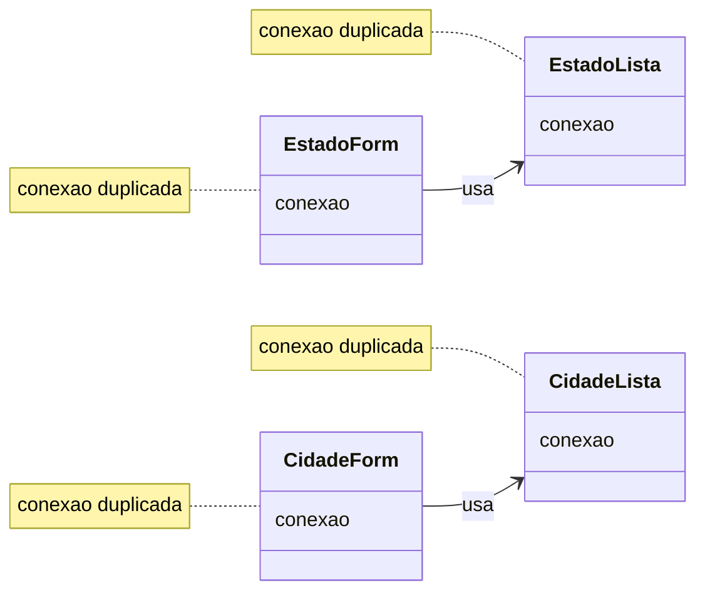

# Diagrama de classes — Fase 1

## Leitura

* Cada classe possui sua própria conexão
* A conexão está duplicada em todas as classes
* Não existe centralização

## Problema

Se mudar a conexão, quantos lugares preciso alterar?

* repetição de código
* acoplamento
* difícil manutenção

